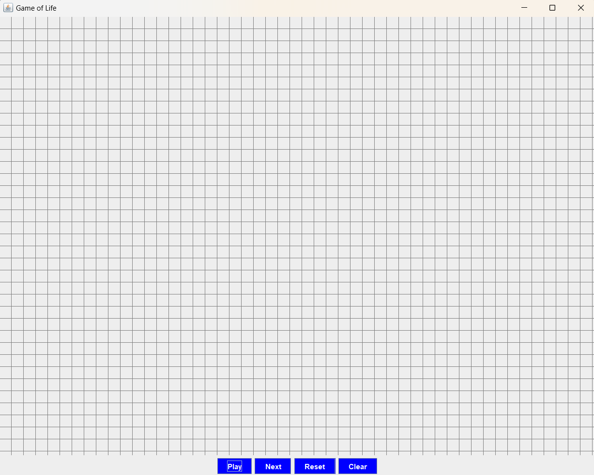
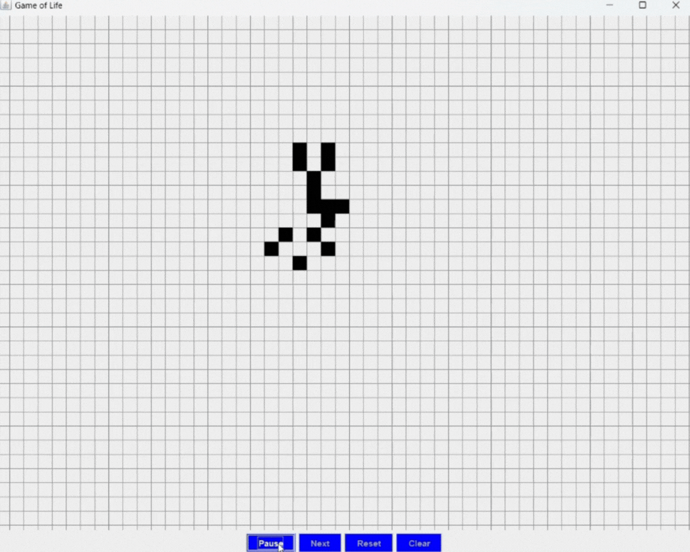
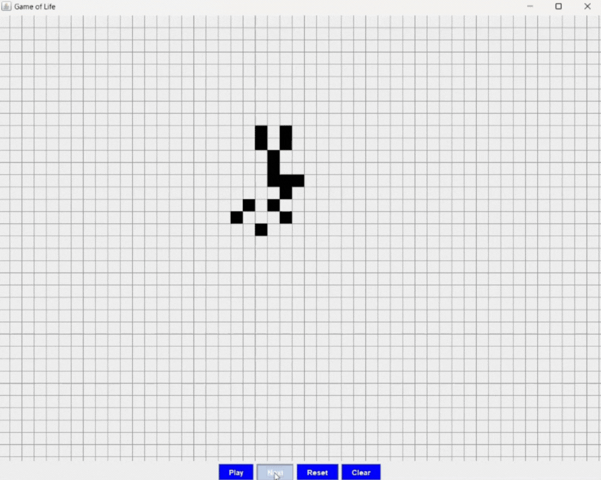
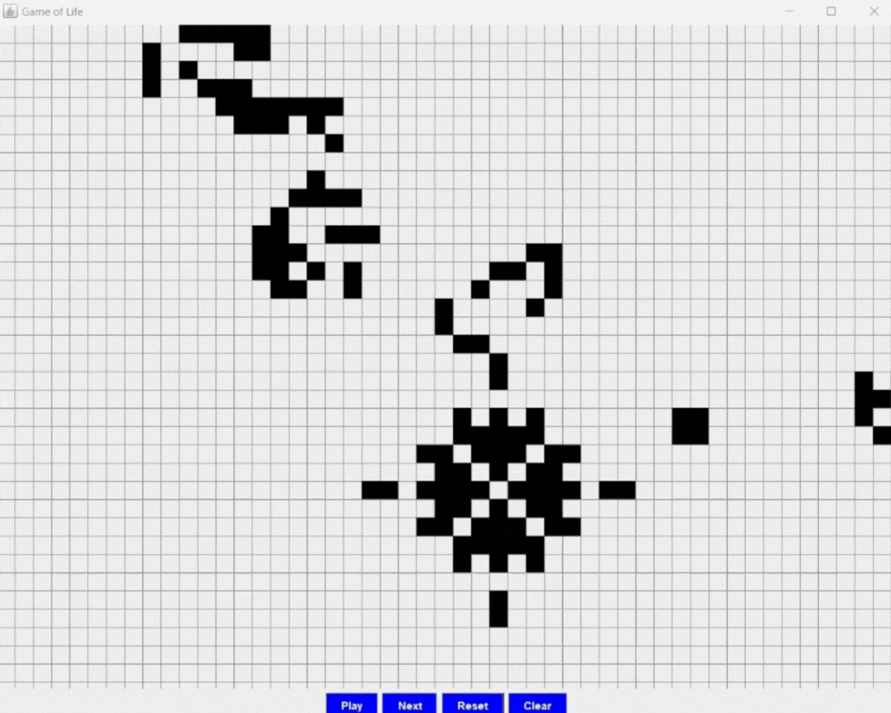
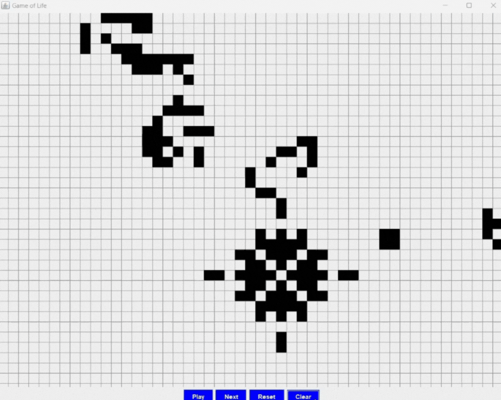
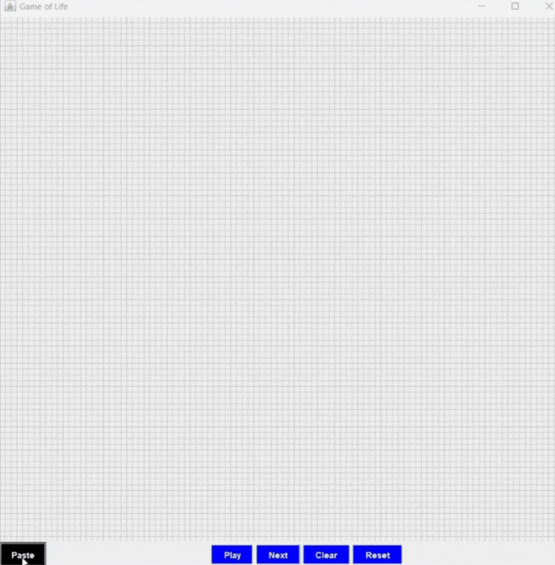

# Conway's Game of Life

## Overview
This program creates a version of Conway's Game of Life. It implements the rules of the game
and has a GUI that allows the user to play the Game of Life.

### Starting View

### Play/Pause Button

### Next Button

### Reset Button 

### Clear Button

### Links

[Conway's Game of Life Wikipedia Page](https://en.wikipedia.org/wiki/Conway%27s_Game_of_Life)

[Play Conway's Game of Life](https://playgameoflife.com/)

## RLE
This part of the program takes an RLE file format of a glider from Conway's Game of Life.
It can take it as one of three types: a file, a url, or plain text.
When the user presses "Paste", the RLE will be copied from the clipboard and then decoded.
Using the decoded file, the glider appears in the center of the grid and
it will move in its pattern when the user presses play.

### Links

[LifeWiki: RLE](https://conwaylife.com/wiki/Run_Length_Encoded)

[LifeWiki: Glider](https://conwaylife.com/wiki/Glider)

[Glider RLE](https://conwaylife.com/patterns/glider.rle)